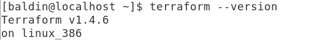

# Домашнее задание к занятию «Введение в Terraform» - Балдин

### Цель задания

1. Установить и настроить Terrafrom.
2. Научиться использовать готовый код.

------

### Чеклист готовности к домашнему заданию

1. Скачайте и установите актуальную версию **terraform** >=1.4.X . Приложите скриншот вывода команды ```terraform --version```.

   > 

2. Скачайте на свой ПК данный git репозиторий. Исходный код для выполнения задания расположен в директории **01/src**.
3. Убедитесь, что в вашей ОС установлен docker.

------

### Инструменты и дополнительные материалы, которые пригодятся для выполнения задания

1. Установка и настройка Terraform  [ссылка](https://cloud.yandex.ru/docs/tutorials/infrastructure-management/terraform-quickstart#from-yc-mirror)
2. Зеркало документации Terraform  [ссылка](https://registry.tfpla.net/browse/providers) 
3. Установка docker [ссылка](https://docs.docker.com/engine/install/ubuntu/) 
------

### Задание 1

1. Перейдите в каталог [**src**](https://github.com/netology-code/ter-homeworks/tree/main/01/src). Скачайте все необходимые зависимости, использованные в проекте. 
2. Изучите файл **.gitignore**. В каком terraform файле согласно этому .gitignore допустимо сохранить личную, секретную информацию?

   > #### Согласно этому **.gitignore** допустимо сохранить личную, секретную информацию в файле `personal.auto.tfvars`

3. Выполните код проекта. Найдите  в State-файле секретное содержимое созданного ресурса **random_password**, пришлите в качестве ответа конкретный ключ и его значение.

   > #### `"result": "iZBISwVzK3oB7m6v"`

4. Раскомментируйте блок кода, примерно расположенный на строчках 29-42 файла **main.tf**.
Выполните команду ```terraform validate```. Объясните в чем заключаются намеренно допущенные ошибки? Исправьте их.

   > #### Вывод указывает на две ошибки: отсутствующее имя описываемого ресурса "docker_image", недопустимое имя у "docker_container":
   > ```bash
   > ╷
   > │ Error: Missing name for resource
   > │ 
   > │   on main.tf line 23, in resource "docker_image":
   > │   23: resource "docker_image" {
   > │ 
   > │ All resource blocks must have 2 labels (type, name).
   > ╵
   > ╷
   > │ Error: Invalid resource name
   > │ 
   > │   on main.tf line 28, in resource "docker_container" "1nginx":
   > │   28: resource "docker_container" "1nginx" {
   > │ 
   > │ A name must start with a letter or underscore and may contain only
   > │ letters, digits, underscores, and dashes.
   > ```
   > #### После исправления указанных ошибок повторная валидация возвращает:
   > ```bash
   > │ Error: Reference to undeclared resource
   > │ 
   > │   on main.tf line 30, in resource "docker_container" "nginx":
   > │   30:   name  = "example_${random_password.random_string_fake.resuld}"
   > ```
   > #### Привожу аргумент к виду `name  = "example_${random_password.random_string.result}"`, и получаю:
   > ```bash
   > root@debian:/home/baldin/01_terraform# terraform validate
   > Success! The configuration is valid.
   > ```

5. Выполните код. В качестве ответа приложите вывод команды ```docker ps```
   > ```bash
   > root@debian:/home/baldin/01_terraform# docker ps
   > CONTAINER ID   IMAGE          COMMAND                  CREATED          STATUS          PORTS                  NAMES
   > eda22daa2347   f9c14fe76d50   "/docker-entrypoint.…"   14 seconds ago   Up 12 seconds   0.0.0.0:8000->80/tcp   example_iZBISwVzK3oB7m6v
   > ```

6. Замените имя docker-контейнера в блоке кода на ```hello_world```, выполните команду ```terraform apply -auto-approve```.
Объясните своими словами, в чем может быть опасность применения ключа  ```-auto-approve``` ? В качестве ответа дополнительно приложите вывод команды ```docker ps```

   > #### Очевидно, опасность применения `-auto-approve` в том, что у нас в этом случае нет возможности посмотреть план, все изменения, которые внесет `apply`. Последствия    > могут быть необратимыми. Прилагаю вывод `docker ps`:
   > ```bash
   > root@debian:/home/baldin/01_terraform# docker ps
   > CONTAINER ID   IMAGE          COMMAND                  CREATED         STATUS         PORTS                  NAMES
   > b093e9c28b02   f9c14fe76d50   "/docker-entrypoint.…"   6 seconds ago   Up 5 seconds   0.0.0.0:8000->80/tcp   hello_world
   > ```

7. Уничтожьте созданные ресурсы с помощью **terraform**. Убедитесь, что все ресурсы удалены. Приложите содержимое файла **terraform.tfstate**. 
8. Объясните, почему при этом не был удален docker образ **nginx:latest** ? Ответ подкрепите выдержкой из документации провайдера.
   > #### Всё дело в аргументе `keep_locally`. Если он установлен в `true` - терраформ оставит образ в локальном хранилище докера, а если значение `false` - образ будет        > удален оттуда. Протестировал - и правда так.
   > [Вот что я нашел по этому поводу](https://registry.terraform.io/providers/kreuzwerker/docker/latest/docs/resources/image)
